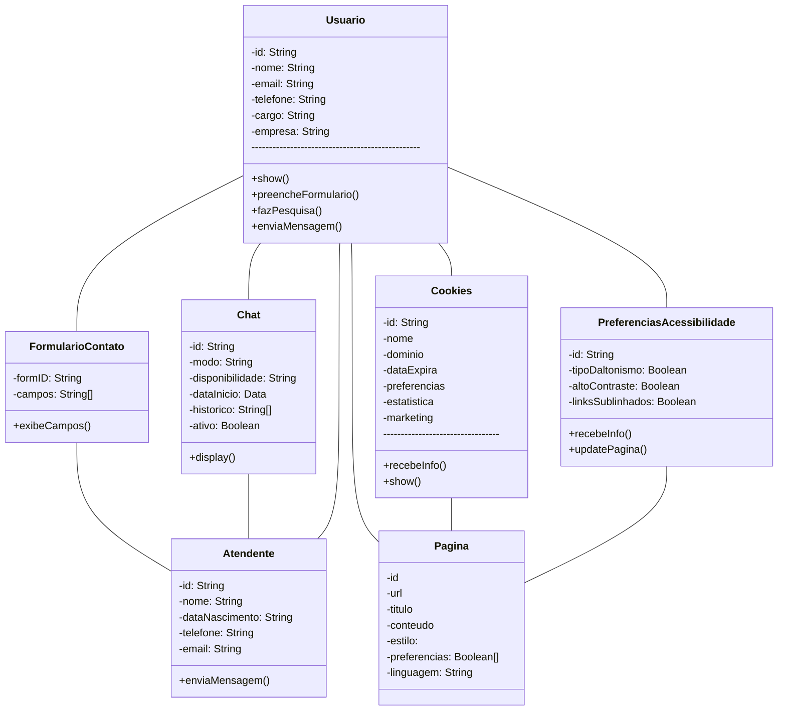

```mermaid
classDiagram
    direction TB
    class Usuario {
        -id: String
        -nome: String
        -email: String
        -telefone: String
        -cargo: String
        -empresa: String
        ------------------------------------------------
        +show()
        +preencheFormulario()
        +fazPesquisa()
        +enviaMensagem()


    }

    class Atendente { 
        -id: String
        -nome: String
        -dataNascimento: String
        -telefone: String
        -email: String
        +enviaMensagem()
    }

    class FormularioContato {
        -formID: String
        -campos: String[]
        +exibeCampos()
    }

    class PreferenciasAcessibilidade {
        -id: String
        -tipoDaltonismo: Boolean
        -altoContraste: Boolean
        -linksSublinhados: Boolean
        +recebeInfo()
        +updatePagina()
    }

    class Chat {
        -id: String
        -modo: String
        -disponibilidade: String
        -dataInicio: Data
        -historico: String[]
        -ativo: Boolean
        +display()
    }

    class Pagina {
        -id
        -url
        -titulo
        -conteudo
        -estilo: 
        -preferencias: Boolean[]
        -linguagem: String
    }

    class Cookies {
        -id: String
        -nome
        -dominio
        -dataExpira
        -preferencias
        -estatistica
        -marketing
        +recebeInfo()
        +show()
        ---------------------------------
    }

    Atendente -- Usuario
    FormularioContato -- Atendente
    Chat -- Atendente

    Usuario -- FormularioContato
    Usuario -- Cookies
    Usuario -- PreferenciasAcessibilidade
    Usuario -- Chat   
    Usuario -- Pagina

    Cookies -- Pagina
    PreferenciasAcessibilidade -- Pagina
```