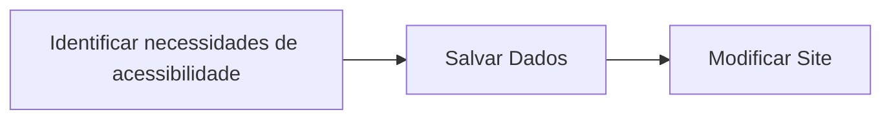

> [!abstract]  Grupo
> - Artur Lopes Fiorindo 553481 
> - Eduardo Felipe Nunes Função 553362 
> - Jhoe Yoshio Kochi Hashimoto 553831  

Pensando em melhorar a experiência do usuário com **questões de acessibilidade** enquanto interage com o site da Sales Force, a solução proposta procura transformar o fluxo de consentimento dos cookies em uma oportunidade valiosa: a aplicação irá coletar informações importantes sobre as necessidades de acessibilidade do usuário no mesmo formulário/modal de aceite dos cookies e, com base nesses dados, personalizar sua experiência baseado nessas necessidades. A princípio, como forma de **desenvolver um MVP de forma ágil**, as necessidades de pessoas daltônicas serão implementadas de forma introdutória. 
Baseado nisso, as cores e disposição do texto e elementos da tela serão modificados para melhor atender os visitantes. Essas informações também podem ser usadas futuramente (dependendo da preferência do usuário) para alimentar a base de dados da empresa a fim de que a Sales Force possa entender melhor o **perfil de acessibilidade** da pessoa que visite seu portal. 

### 4 Pilares do Pensamento Computacional
A fim de tornar o desenvolvimento do sistema mais eficiente e direcionado, foi utilizada a ferramente dos quatro pilares do pensamento computacional para nortear o andamento do projeto. A seguir está explícito como cada uma dessas bases foi utilizada.

1. Decomposição
Para decomposição do problema maior em **partes menores gerenciáveis**, a ideia é que partimos de um problema abstrato - melhorar a acessibilidade do portal da Sales Force - e queremos identificar atividades práticas que podem ser implementadas modularmente e de forma direcionada dentro de um projeto. No diagrama abaixo, as atividades dos dois primeiros níveis representam o **nível conceitual**, sendo simplesmente conceitos mais brandos do que deve ser feito.
Desses níveis, descendo a árvore lógica, chegamos no **nível prático**, no qual as atividades definidas são muito mais palpáveis e de menor escopo. Isso é vantajoso pois, em um grande projeto, podemos delegar estas atividades menores a pessoas que não necessariamente conhecem o objetivo final do projeto, mas, desde que possam concluir cada atividade, almejam o objetivo final (do primeiro nível do projeto). 
Além disso dividindo cada uma das etapas do projeto em atividades menores e relacionadas, garantimos que, realizando todas as atividades de menor complexidade, existem maiores chances de que os **objetivos das atividades mais abstratas sejam alcançados**.
Mais especificamente para a nossa solução, todo o projeto é segregado em: identificação das necessidades de acessibilidade, modificação do site com base nelas, o salvar dos dados e a adaptação às ferramentas externas de acessibilidade. Desses, atividades mais práticas e bem definidas surgem, como, por exemplo, modificação do CSS com atributos específicos, e funcionalidades de acessibilidade como a skip to content

![[fluxogramaDecomposicao.png]]

2. Padrões
Os **padrões** identificados dentro de um ambiente de desenvolvimento são essenciais para que o trabalho se torne uniforme e que se evite retrabalhos desnecessários - quando, por exemplo, criamos duas funções que realizam a mesma lógica por falta de planejamento ou percepção do problema.
Para a nossa solução, podemos citar alguns **padrões** identificados pela equipe de desenvolvimento:
- Não importa a ferramenta, ou o forma como implementar a operação geral do site para obter, modificar e guardar as necessidades de acessibilidade do usuário, elas sempre seguirão um esquema equivalente ao fluxo a seguir:

A identificação das necessidades, por exemplo, pode ser feita tanto pelo preenchimento do formulário de acessibilidade pelo usuário, quanto pelo chat, identificado automaticamente pelo bot ou por um atendente em chat ao vivo. De toda forma, independente de como esses dados sejam obtidos, podemos seguir o mesmo **padrão** para salvar o site e modificá-lo com base nesses dados.

- Outra questão importante que também representação um **padrão** a ser seguido tem relação com as diretrizes nacionais e internacionais para o desenvolvimento de sites acessíveis: direcionado pela **eMAG e WCAG**, respectivamente. Esses **padrões**  uniformizam o aceleram o processo de criação e adaptação de sites acessíveis.

- Por fim, podemos citar uma estratégia que usamos para que a entrega pudesse ser feita mais rapidamente aos stakeholders. Inicialmente, o formulário de acessibilidade somente irá tratar o caso de o usuário ser daltônico ou não e, baseado nisso, modificar o estilo e layout do site. Essa foi uma decisão para simplificar e acelerar o desenvolvimento do site, mas sem impactar tão fortemente na qualidade da entrega final. Futuramente, podemos usar o mesmo **padrão** para o tratamento de usuários daltônicos para usuários com diferentes **necessidades de acessibilidade**.

3. Abstração
Como forma de simplificar o problema em mãos e focar forças em somente componentes estritamente necessários para o funcionamento do sistema, a abstração de conceitos complexos pode ser uma estratégia para ganhar agilidade dentro do desenvolvimento. Citando alguns exemplos para a nossa solução: 
- Não precisamos entender exatamente como ocorre o o funcionamento dos cookies de um site. Simplesmente podemos conhecer como implementá-los e como obter dados e implementar funcionalidades a partir deles. Assim, evitamos o direcionamento desnecessário de energias para um conceito que, muitas vezes, não vai trazer benefício concreto.
- Entendendo como o usuário com necessidade especial de acessibilidade interage com o nosso site, podemos descobrir quais são suas dores e demandas próprias. Mesmo não conhecendo exatamente como funcionam , sabendo sobre sua operação e finalidade podemos adaptar nosso site de forma mais direcionada à essas tecnologias complementares, como leitores de tela, por exemplo.

4. Algoritmo
Algoritmos são essenciais para melhorar a eficiência de um sistema e utilizar snippets de códigos conhecidos e testados para implementar determinada ideia.
Nessa fase inicial de implementação, algoritmos mais simples foram utilizados para o fluxo normal do site:
- O sistema principal para o tratamento das preferências de acessibilidade do usuário e feito puramente por árvores de decisão através de declarações condicionais simples. 
- Para o campo de busca, por exemplo, no conteúdo do site, será utilizado o algoritmo de rabin-karp, ainda não implementado.
